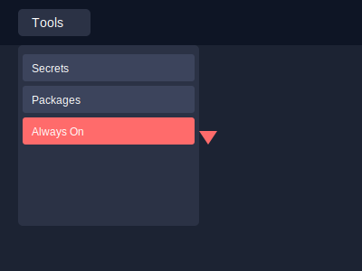
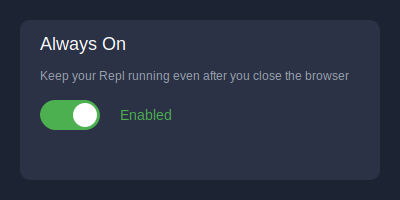

# How to Enable "Always On" Feature in Replit

## Step 1: Access Tools Menu

1. Look for the "Tools" menu in the left sidebar of your Replit workspace
2. Click on it to open the dropdown menu
3. Find "Always On" in the list (highlighted in red)

## Step 2: Enable Always On

1. Click on "Always On" to open the settings panel
2. You'll see a toggle switch and a description
3. Click the toggle to enable "Always On"
4. The status will change to "Enabled" with a green indicator

## Step 3: Verify
1. After enabling, your bot will continue running even when you close the browser
2. You can confirm it's working by:
   - Closing your browser
   - Reopening Replit later
   - Checking if your bot is still responding to commands

## Important Notes
- The "Always On" feature is only available for Replit subscribers
- Your bot will automatically restart if it crashes
- The health check system we implemented will help monitor the bot's status

Need any clarification on these steps?
